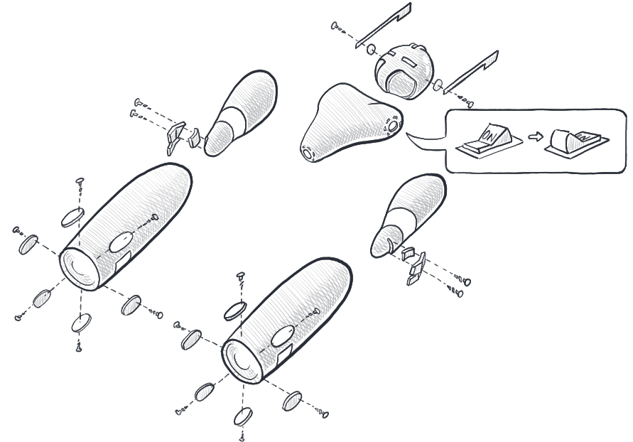

# Props

The Props are used to configure and construct the Actor and its Context.
A form of blueprint on how to assemble an actor.



## Creating Props

The simplest way is to use one the Actor convenience methods, `FromProducer()` or `FromFunc()`. E.g.:

**From an actor producer delegate**

```csharp
var props = Actor.FromProducer(() => new MyActor());
```

**From an actor receive delegate**

```csharp
var props = Actor.FromFunc(context =>
    {
        Console.WriteLine($"Received message {context.Message}");
        return Task.CompletedTask;
    });
```

## Customizing Props

Props exposes a number of methods for customizing the Actor. The following example shows the different methods and their usage (along with defaults where applicable). Some of these will rarely be necessary to change (e.g. Mailbox, Dispatcher, and Spawner) but are included for sake of completeness.

```csharp
var props = new Props()
    // the producer is a delegate that returns a new instance of an IActor
    .WithProducer(() => new MyActor())
    // the default dispatcher uses the thread pool and limits throughput to 300 messages per mailbox run
    .WithDispatcher(new ThreadPoolDispatcher { Throughput = 300 })
    // the default mailbox uses unbounded queues
    .WithMailbox(() => UnboundedMailbox.Create())
    // the default strategy restarts child actors a maximum of 10 times within a 10 second window
    .WithChildSupervisorStrategy(new OneForOneStrategy((who, reason) => SupervisorDirective.Restart, 10, TimeSpan.FromSeconds(10)))
    // middlewares can be chained to intercept incoming and outgoing messages
    // receive middlewares are invoked before the actor receives the message
    // sender middlewares are invoked before the message is sent to the target PID
    .WithReceiveMiddleware(
        next => async c =>
        {
            Console.WriteLine($"middleware 1 enter {c.Message.GetType()}:{c.Message}");
            await next(c);
            Console.WriteLine($"middleware 1 exit");
        },
        next => async c =>
        {
            Console.WriteLine($"middleware 2 enter {c.Message.GetType()}:{c.Message}");
            await next(c);
            Console.WriteLine($"middleware 2 exit");
        })
    .WithSenderMiddleware(
        next => async (c, target, envelope) =>
        {
            Console.WriteLine($"middleware 1 enter {c.Message.GetType()}:{c.Message}");
            await next(c, target, envelope);
            Console.WriteLine($"middleware 1 enter {c.Message.GetType()}:{c.Message}");
        },
        next => async (c, target, envelope) =>
        {
            Console.WriteLine($"middleware 2 enter {c.Message.GetType()}:{c.Message}");
            await next(c, target, envelope);
            Console.WriteLine($"middleware 2 enter {c.Message.GetType()}:{c.Message}");
        })
    // the default spawner constructs the Actor, Context and Process
    .WithSpawner(Props.DefaultSpawner);
```

## See also

- [Dispatchers](dispatchers.md)
- [Mailboxes](mailboxes.md)
- [Supervision](supervision.md)
- [Middleware](middleware.md)
