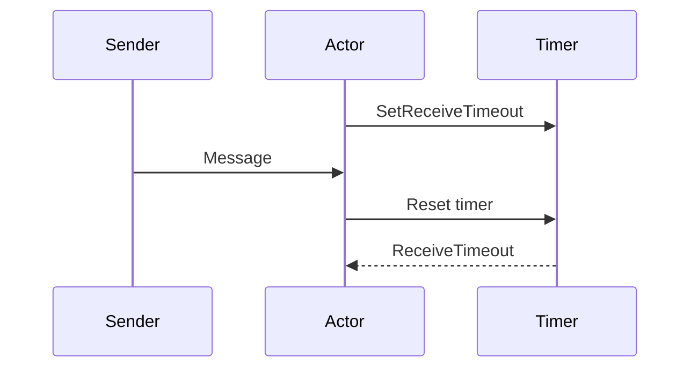

## Receive timeout

The `Context.SetReceiveTimeout` defines the inactivity timeout after which the sending of a `ReceiveTimeout` message is triggered. When specified, the Receive function should be able to handle an `ReceiveTimeout` message.




Please note that the receive timeout might fire and enqueue the ReceiveTimeout message right after another message was enqueued; hence it is not guaranteed that upon reception of the receive timeout there must have been an idle period beforehand as configured via this method.


Once set, the receive timeout stays in effect (i.e. continues firing repeatedly after inactivity periods). Pass in `nil` / `null` to `SetReceiveTimeout` to switch off this feature.

#### .NET

```csharp
var props = Props.FromFunc(context =>
{
    switch (context.Message)
    {
        case Started _:
            context.SetReceiveTimeout(TimeSpan.FromSeconds(1));
            break;
        
        //this will fire after 1 second of "silence", not receiving any other messages
        case ReceiveTimeout _:           
            Console.WriteLine("ReceiveTimeout");
            break;        
    }
    return Task.CompletedTask;
});
```

#### Go

```go
props := actor.PropsFromFunc(func(context actor.Context) {
    switch msg := context.Message().(type) {
    case *actor.Started:
        context.SetReceiveTimeout(1 * time.Second)

    //this will fire after 1 second of "silence", not receiving any other messages
    case *actor.ReceiveTimeout:
        log.Printf("ReceiveTimeout")
    }
})
```


By setting the receive-timeout, you are setting a timer to a specific interval and the timer starts to count down from this.
Once the timer ends, it will send a `ReceiveTimeout` message to itself.
And the timer resets and starts over again.

Should the actor receive any message during this time, the timer will also reset, and start counting from the specified duration again.

Meaning, `ReceiveTimeout` will only be received after at not receiving any messages for at least the time of the duration.

## Non-influencing messages

There is a way to still send messages to an actor without resetting the receive-timeout timer.
You can do this by marking your message as `NoInfluence`.

