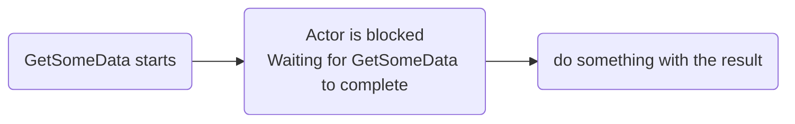
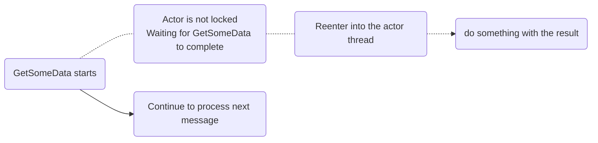

# Context.ReenterAfter

`Context.ReenterAfter` allows you to combine asynchronous operations with the actor-models single-threaded semantics.

Instead of `await`-ing a .NET `Task`, which would block the actor from processing more messages while the task is running.
You can instead allow the completion of the task to be scheduled back into the actors concurrency control.

Behind the covers, `Context.ReenterAfter(task, callback)` uses a task continuation and pass the callback as a message, back to the actor itself.

**Simplified pseudo implementation of ReenterAfter:**

```csharp
someTask.ContinueWith(t => context.Send(context.Self, new Continuation(callback, someTask)))
```

Imagine the following code:

```csharp
public async Task Receive(IContext context)
{
    if (context.Message is DoStuff)
    {
        var data = await MyDataAccessLayer.GetSomeData(...);

        //do something with the result
        //....
    }
}

```

This would execute as follows:



While if we introduce `ReenterAfter`, like so:

```csharp
public async Task Receive(IContext context)
{
    if (context.Message is DoStuff)
    {
        var dataTask = MyDataAccessLayer.GetSomeData(...);
        context.ReenterAfter(dataTask, data => {
            //do something with the result
            //....
        });
    }
}

```

We instead get this execution flow:


