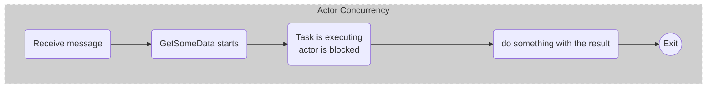
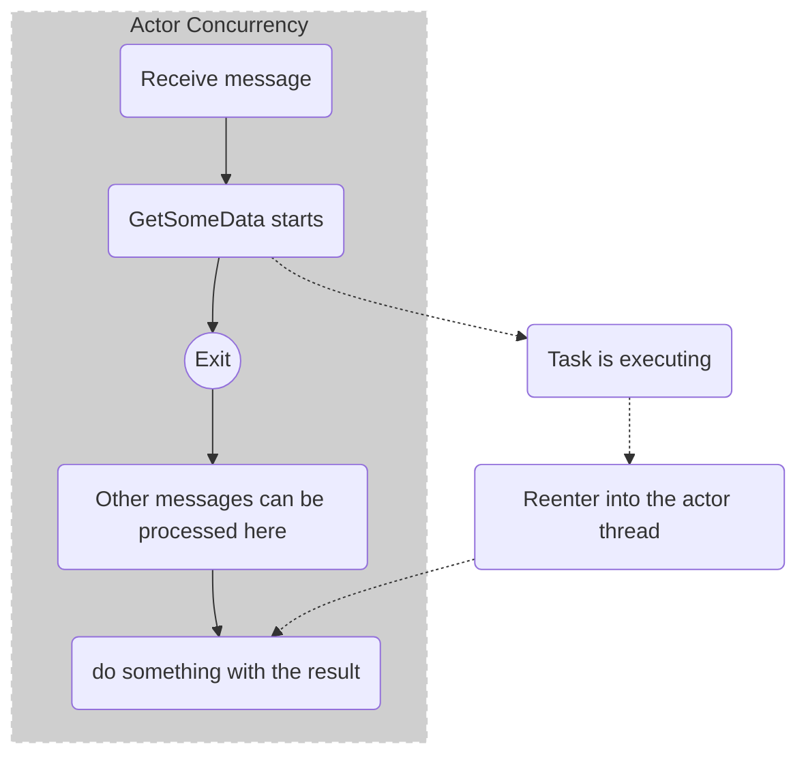

# Reentrancy

`Context.ReenterAfter` allows you to combine asynchronous operations with the actor-models single-threaded semantics.

Instead of `await`-ing a .NET `Task`, which would block the actor from processing more messages while the task is running.
You can instead allow the completion of the task to be scheduled back into the actors concurrency control. The re-entrancy feature is highly useful while dealing with database operations or writing to network streams within an actor.

Behind the covers, `Context.ReenterAfter(task, callback)` uses a task continuation and pass the callback as a message, back to the actor itself.

**Simplified pseudo implementation of ReenterAfter:**

```csharp
someTask.ContinueWith(t => context.Send(context.Self, new Continuation(callback, someTask)))
```

Imagine the following code:

```csharp
public async Task Receive(IContext context)
{
    if (context.Message is DoStuff)
    {
        var data = await MyDataAccessLayer.GetSomeData(...);

        //do something with the result
        //....
    }

    //Exit
}

```

This would execute as follows:



While if we introduce `ReenterAfter`, like so:

```csharp
public async Task Receive(IContext context)
{
    if (context.Message is DoStuff)
    {
        var dataTask = MyDataAccessLayer.GetSomeData(...);
        context.ReenterAfter(dataTask, data => {
            //do something with the result
            //....
        });
    }

    //Exit
}

```

We instead get this execution flow:



## Handling Return Values in Asynchronous Operations

In scenarios where your asynchronous operations return values, you can implement reentrancy for more efficient task handling. Below are steps to transform a standard task handling method into a reentrant one:

### Standard Task Handling Example
Consider an actor generated from a protobuf file with a `DoStuff` method:

```csharp
public override async Task<DoStuffResponse> DoStuff(DoStuffRequest request)
{
   // Standard approach: await the completion of an asynchronous service task.
   return await _someService.DoStuffAsync(request.StuffId, Context.CancellationToken);
}
```

### Transforming to Reentrant Task Handling
To enable reentrancy, modify the `DoStuff` method as follows:

```csharp
public override async Task DoStuff(DoStuffRequest request, Action<DoStuffResponse> respond, Action<string> onError)
{
   // Begin the asynchronous task without waiting for its completion.
   var task = _someService.DoStuffAsync(request.StuffId, Context.CancellationToken);

   // Use reentrancy to handle the task completion.
   Context.ReenterAfter(task, async (completedTask) => 
   {
      if(completedTask.IsCompletedSuccessfully) 
      {
         // Pass the result back upon task completion.
         respond(await completedTask);
      }
   });

   // Immediate return allows the actor to process other messages.
   return;
}

// You do need to override the abstract version of the generated DoStuff method to appease the compiler, but it won't be invoked.
public override async Task<DoStuffResponse> DoStuff(DoStuffRequest request) => Task.FromResult(new DoStuffResponse());
```

This modification enables your actor to handle other incoming messages while the asynchronous task is running, enhancing throughput and avoiding potential deadlocks (see [deadlock prevention](./deadlocks)). The `respond` callback is invoked with the task result once it completes, maintaining the ability to return results to the caller.
