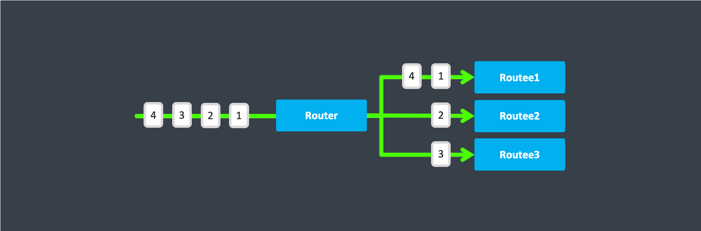

# Routers

A _router_ is a special type of actor whose job is to route messages to other actors called _routees_. Different routers use different _strategies_ to route messages efficiently.


Routers can be used inside or outside of an actor, and you can manage the routees yourself or use a self contained router actor with configuration capabilities, and can also [resize dynamically](#dynamically-resizable-pools) under load.

Proto.Actor comes with several useful routers you can choose right out of the box, according to your application's needs. But it is also possible to create your own.


In general, any message sent to a router will be forwarded to one of its routees, but there is one exception.
The special [Broadcast Message](#broadcast-messages) will be sent to all routees. See [Specially Handled Messages](#specially-handled-messages) section for details.


## Deployment

The example below shows how to deploy 5 workers using a round robin router:

Example in C#

```cs
//pool of 5 workers
var props = system.Root.NewRoundRobinPool(MyActorProps, 5);
var pid = system.Root.Spawn(props);
```

## Pools vs. Groups

There are two types of routers:

### Pools

Router "Pools" are routers that create their own worker actors, that is; you provide the _number of instances_ as a parameter to the router and the router will handle routee creation by itself.

### Groups

Sometimes, rather than having the router actor create its routees, it is desirable to create routees yourself and provide them to the router for its use. You can do this by passing the PIDs of the routees to the group router


Most routing strategies listed below are available in both types. Some of them may be available only in one type due to implementation requirements.


#### Supervision

Routers are implemented as actors, so a router is supervised by it's parent, and they may supervise children.

_Group routers_ use routees created somewhere else, it doesn't have children of its own. If a routee dies, a group router will have no knowledge of it.

_Pool routers_ on the other hand create their own children. The router is therefore also the routee's supervisor.

By default, pool routers use a custom strategy that only returns `Escalate` for all exceptions, the router supervising the failing worker will then escalate to it's own parent, if the parent of the router decides to restart the router, all the pool workers will also be recreated as a result of this.

## Routing Strategies

These are the routing strategies provided by Proto.Actor out of the box.

### RoundRobin

`RoundRobinPool` and `RoundRobinGroup` are routers that sends messages to routees in [round-robin](http://en.wikipedia.org/wiki/Round-robin) order. It's the simplest way to distribute messages to multiple worker actors, on a best-effort basis.



#### Usage:

`RoundRobinPool` defined in code:

```cs
//pool of 5 workers
var props = system.Root.NewRoundRobinPool(MyActorProps, 5);
var pid = system.Root.Spawn(props);
```

`RoundRobinGroup` defined in code:

```cs
var system = new ActorSystem();
var props = context.NewRoundRobinGroup(
    system.Root.Spawn(MyActorProps),
    system.Root.Spawn(MyActorProps),
    system.Root.Spawn(MyActorProps),
    system.Root.Spawn(MyActorProps)
);
var pid = system.Root.Spawn(props);
```

### Broadcast

The `BroadcastPool` and `BroadcastGroup` routers will, as the name implies, broadcast any message to all of its routees.


#### Usage:

`BroadcastPool` defined in code:

```cs
var system = new ActorSystem();
var props = system.Root.NewBroadcastPool(MyActorProps, 5);
var pid = system.Root.Spawn(props);
```

`BroadcastGroup` defined in code:

```cs
var system = new ActorSystem();
var props = system.Root.NewConsistentHashGroup(
    system.Root.Spawn(MyActorProps),
    system.Root.Spawn(MyActorProps),
    system.Root.Spawn(MyActorProps),
    system.Root.Spawn(MyActorProps)
);
```

### Random

The `RandomPool` and `RandomGroup` routers will forward messages to routees in random order.

#### Usage:

`RandomPool` defined in code:

```cs
var system = new ActorSystem();
var props = system.Root.NewRandomPool(MyActorProps, 5);
var pid = system.Root.Spawn(props);
```

`RandomGroup` defined in code:

```cs
var system = new ActorSystem();
var props = system.Root.NewRandomGroup(
    system.Root.Spawn(MyActorProps),
    system.Root.Spawn(MyActorProps),
    system.Root.Spawn(MyActorProps),
    system.Root.Spawn(MyActorProps)
);
```

### ConsistentHashing

The `ConsistentHashingPool` and `ConsistentHashingGroup` are routers that use a [consistent hashing algorithm](http://en.wikipedia.org/wiki/Consistent_hashing) to select a routee to forward the message. The idea is that messages with the same key are forwarded to the same routee. Any .NET object can be used as a key, although it's usually a number, string or Guid.


`ConsistentHash` can be very useful when dealing with **Commands** in the sense of [**CQRS**](http://en.wikipedia.org/wiki/Command%E2%80%93query_separation#Command_Query_Responsibility_Segregation) or [**Domain Driven Design**].

For example, let's assume we have the following incoming sequence of **"Customer Commands"**:

//TODO

## Specially Handled Messages

Most messages sent to router will be forwarded according to router's routing logic. However there are a few types of messages that have special behavior.

### Broadcast Messages

A `Broadcast` message can be used to send message to **all** routees of a router. When a router receives `Broadcast` message, it will broadcast that message's **payload** to all routees, no matter how that router normally handles its messages.

Here is an example of how to send a message to every routee of a router.

//TODO

In this example, the router received the `Broadcast` message, extracted its payload (`Hello, workers`), and then dispatched it to all its routees. It is up to each routee actor to handle the payload.

## Advanced

### How Routing is Designed within Proto.Actor

On the surface routers look like normal actors, but they are actually implemented differently. Routers are designed to be extremely efficient at receiving messages and passing them quickly on to routees.

A normal actor can be used for routing messages, but an actor's single-threaded processing can become a bottleneck. Routers can achieve much higher throughput with an optimization to the usual message-processing pipeline that allows concurrent routing. This is achieved by embedding routers' routing logic directly in their ActorRef rather than in the router actor. Messages sent to a router's ActorRef can be immediately routed to the routee, bypassing the single-threaded router actor entirely.

The cost to this is, of course, that the internals of routing code are more complicated than if routers were implemented with normal actors. Fortunately all of this complexity is invisible to consumers of the routing API. However, it is something to be aware of when implementing your own routers.

### Router Logic

//TODO
