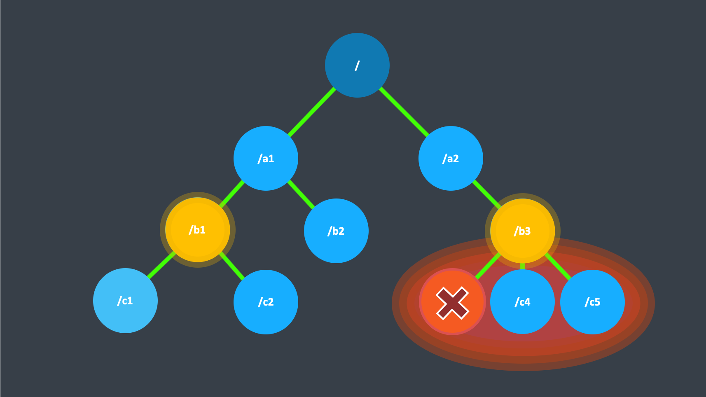

# Supervision

This document outlines the concept behind supervision and what that means for your Proto.Actor actors at run-time.

## What Supervision Means

Supervision describes a dependency relationship between actors: the supervisor delegates tasks to subordinates and therefore must respond to their failures. When a subordinate detects a failure (i.e. throws an exception), it suspends itself and all its subordinates and sends a message to its supervisor, signaling failure. Depending on the nature of the work to be supervised and the nature of the failure, the supervisor has a choice of the following four options:

* **Resume** the subordinate, keeping its accumulated internal state
* **Restart** the subordinate, clearing out its accumulated internal state
* **Stop** the subordinate permanently
* **Escalate** the failure to the next parent in the hierarchy, thereby failing itself

It is important to always view an actor as part of a supervision hierarchy, which explains the existence of the fourth choice (as a supervisor also is subordinate to another supervisor higher up) and has implications on the first three: resuming an actor resumes all its subordinates, restarting an actor entails restarting all its subordinates (but see below for more details), similarly terminating an actor will also terminate all its subordinates. It should be noted that the default behavior of the `Restarting` event of actors is to terminate all its children before restarting, but this hook can be overridden; the recursive restart applies to all children left after this hook has been executed.

Each supervisor is configured with a function translating all possible failure causes (i.e. exceptions) into one of the four choices given above; notably, this function does not take the failed actor's identity as an input. It is quite easy to come up with examples of structures where this might not seem flexible enough, e.g. wishing for different strategies to be applied to different subordinates. At this point it is vital to understand that supervision is about forming a recursive fault handling structure. If you try to do too much at one level, it will become hard to reason about, hence the recommended way in this case is to add a level of supervision.

Proto.Actor implements a specific form called “parental supervision”. Actors can only be created by other actors—where the top-level actor is provided by the library—and each created actor is supervised by its parent. This restriction makes the formation of actor supervision hierarchies implicit and encourages sound design decisions. It should be noted that this also guarantees that actors cannot be orphaned or attached to supervisors from the outside, which might otherwise catch them unawares. In addition, this yields a natural and clean shutdown procedure for (sub-trees of) actor applications.


Supervision related parent-child communication happens by special system messages that have their own  
mailboxes separate from user messages. This implies that supervision related events are not deterministically  
ordered relative to ordinary messages. In general, the user cannot influence the order of normal messages and  
failure notifications. For details and example see the Discussion: Message Ordering section.


## The Top-Level Supervisors

Supervisors in Proto.Actor are any type that implements the supervisor interface.
This means that both actors and non actors can be supervisors.

At the top of Proto.Actor are N number of non actor based supervisors.

## What Restarting Means

When presented with an actor which failed while processing a certain message, causes for the failure fall into three categories:

* Systematic (i.e. programming) error for the specific message received
* (Transient) failure of some external resource used during processing the message
* Corrupt internal state of the actor

Unless the failure is specifically recognizable, the third cause cannot be ruled out, which leads to the conclusion that the internal state needs to be cleared out. If the supervisor decides that its other children or itself is not affected by the corruption—e.g. because of conscious application of the error kernel pattern—it is therefore best to restart the child. This is carried out by creating a new instance of the underlying Actor class and replacing the failed instance with the fresh one inside the child's `PID`; the ability to do this is one of the reasons for encapsulating actors within special references. The new actor then resumes processing its mailbox, meaning that the restart is not visible outside of the actor itself with the notable exception that the message during which the failure occurred is not re-processed.

The precise sequence of events during a restart is the following:

1. Suspend the actor (which means that it will not process normal messages until resumed).
2. Call the old instance's `PreRestart` hook (defaults to sending termination requests to all children and calling postStop)
3. Wait for all children which were requested to terminate (using `context.Stop()`) during `PreRestart` to actually terminate; this—like all actor operations—is non-blocking, the termination notice from the last killed child will effect the progression to the next step.
4. Create new actor instance by invoking the originally provided factory again.
5. Invoke `PostRestart` on the new instance (which by default also calls `PreStart`)
6. Send restart request to all children which were not killed in step 3; restarted children will follow the same process recursively, from step 2
7. Resume the actor.

## What Lifecycle Monitoring Means

In contrast to the special relationship between parent and child described above, each actor may monitor any other actor. Since actors emerge from creation fully alive and restarts are not visible outside of the affected supervisors, the only state change available for monitoring is the transition from alive to dead. Monitoring is thus used to tie one actor to another so that it may react to the other actor's termination, in contrast to supervision which reacts to failure.

Lifecycle monitoring is implemented using a `Terminated` message to be received by the monitoring actor. In order to start listening for Terminated messages, invoke `Context.Watch(targetPID)`. To stop listening, invoke `Context.Unwatch(targetPID)`. One important property is that the message will be delivered irrespective of the order in which the monitoring request and target's termination occur, i.e. you still get the message even if at the time of registration the target is already dead.

Monitoring is particularly useful if a supervisor cannot simply restart its children and has to terminate them, e.g. in case of errors during actor initialization. In that case it should monitor those children and re-create them or schedule itself to retry this at a later time.

Another common use case is that an actor needs to fail in the absence of an external resource, which may also be one of its own children. If a third party terminates a child by way of the `pid.Stop()` method or sending a `PoisonPill`, the supervisor might well be affected.

### One-For-One Strategy vs. All-For-One Strategy

There are two classes of supervision strategies which come with Proto.Actor: `OneForOneStrategy` and `AllForOneStrategy`. Both are configured with a mapping from exception type to supervision directive (see above) and limits on how often a child is allowed to fail before terminating it. The difference between them is that the former applies the obtained directive only to the failed child, whereas the latter applies it to all siblings as well. Normally, you should use the `OneForOneStrategy`, which also is the default if none is specified explicitly.

The `AllForOneStrategy` is applicable in cases where the ensemble of children has such tight dependencies among them, that a failure of one child affects the function of the others, i.e. they are inextricably linked. Since a restart does not clear out the mailbox, it often is best to terminate the children upon failure and re-create them explicitly from the supervisor (by watching the children's lifecycle); otherwise you have to make sure that it is no problem for any of the actors to receive a message which was queued before the restart but processed afterwards.

Normally stopping a child (i.e. not in response to a failure) will not automatically terminate the other children in an all-for-one strategy; this can easily be done by watching their lifecycle: if the `Terminated` message is not handled by the supervisor, it will throw a `DeathPactException` which (depending on its supervisor) will restart it, and the default `PreRestart` action will terminate all children. Of course this can be handled explicitly as well.
