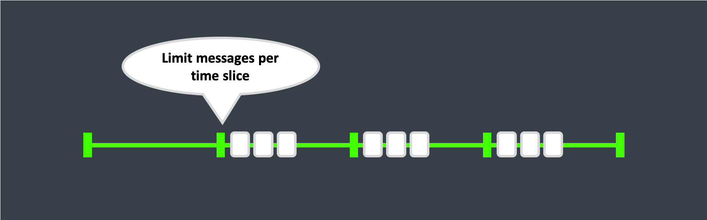

# Message Throttling

## Simple throttling

In the most simple case, we can throttle message processing for an actor by adding a delay after each message processing.

Making the actor receive a message, handle it, wait for X time.
Then receive the next message if available.


This works and might be enough for some scenarios.
But it would come with the drawback that every message send would cause a delay. 
Even if your actor only receives two messages for an hour, if you send those messages directly after each other, the second message would still have to wait before being processed.

Example Implementation, C#:
```csharp
public class ThrottledActor : IActor
{
    public async Task ReceiveAsync(IContext context)
    {
        switch (context.Message)
        {
            case string msg:
            {
                Console.WriteLine("Got Message " + msg);

                //add the required delay here
                await Task.Delay(TimeSpan.FromMilliseconds(333));
                break;
            }
        }
    }
}
```

## Time-sliced throttling



Another approach to throttling is to divide message consumption into time slices.
This is commonly seen in external APIs for example, a vendor might allow you to make 100 calls to their services per minute.
GitHub and others implement such an approach.

Basically what this does is that it allows you to make X number of request, without any restrictions, there are no additional delays, within a given slice of time.

If you try to push more requests than allowed during this time slice, those requests would be postponed to the next time slice.

Example Implementation, C#:

```csharp
// periodically sent to self message
public class Tick {}

public class ThrottledActor : IActor
{
    private readonly Queue<object> _messages = new Queue<object>();
    private readonly ISimpleScheduler _scheduler = new SimpleScheduler();
    private int _tokens = 0;

    public async Task ReceiveAsync(IContext context)
    {
        switch (context.Message)
        {
            case Started _:
            {
                _scheduler.ScheduleTellRepeatedly(TimeSpan.FromSeconds(0), TimeSpan.FromSeconds(1), context.Self, new Tick(), out _);
                break;
            }
            case Tick _:
            {
                _tokens = 3;
                await ConsumeTimeSliceAsync();
                break;
            }
            default:
            {
                _messages.Enqueue(context.Message);
                await ConsumeTimeSliceAsync();
                break;
            }
        }
    }

    private async Task ConsumeTimeSliceAsync()
    {
        while (_tokens > 0 && _messages.Any())
        {
            var message = _messages.Dequeue();
            _tokens--;
            await ThrottledReceiveAsync(message);
        }
    }

    private Task ThrottledReceiveAsync(object message)
    {
        Console.WriteLine("Got Message " + message);
        return Task.CompletedTask;
    }
}
```
