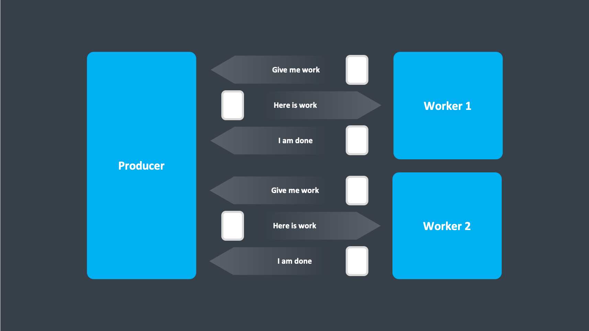

# Work Pulling Pattern

The Work Pulling Pattern was initially introduced by Michael Pollmeier for Akka, in the following blog post https://www.michaelpollmeier.com/akka-work-pulling-pattern

The pattern aims to prevent worker overflow, where the producer produces more work than the workers can handle.

Unhandled, this would result in either an unbounded mailbox overflow, or bounded mailbox dropping messages on the floor.

Instead, the flow is reversed, the worker, tells the producer that it is ready for work.

Once the producer has some work to be done available, it can forward this to one of the ready workers.

The worker receives the work, and sends back the result to the producer, letting the producer know that the worker is yet again ready for work.

This might at first glance seem like polling, which is not the case, as we are still leveraging push semantics whenever the producer push work to one of the ready workers.

Meaning, the worker does not have to repeatedly ask the producer for work, it just signals its availability to receive work.

A more advanced alternative to this pattern would be [Reactive Streams](https://www.reactive-streams.org/), which are available for both JVM and .NET.
e.g. via Akka, MongoDB Reactive Streams Java Provider, Spring Project Reactor and many more.